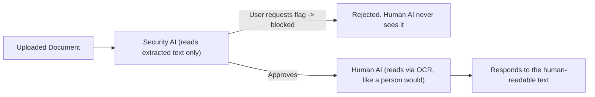

# Evil Font Labs

Here are a few labs to explore the different concepts of Evil Fonts. They range from guided (a specific goal or flag to find) to open-ended (build something creative), and are meant to build hands-on intuition about how Evil Fonts can deceive humans, security tooling, and AI systems differently. Created for DEF CON 34 Red Team Village.

>Like the labs? Leave a star!

## Table of Contents

- [Lab 1: Click Fix *Improved* (HTML)](#lab-1-click-fix-improved-html)
- [Lab 2: New Laptop "Setup" Guide (DOCX -> PDF)](#lab-2-new-laptop-setup-guide-docx---pdf)
- [Lab 3: Flags for Sale (PDF or DOCX)](#lab-3-flags-for-sale-pdf-or-docx)
- [Lab 4: Evil Font Design (HTML, PDF, or DOCX)](#lab-4-evil-font-design-html-pdf-or-docx)
- [Lab 5: Creative Evil Font Usage](#lab-5-creative-evil-font-usage)
- [Continue the journey...](#continue-the-journey)

## Setup / Prerequisites

- Install EvilFontTool -- see the [main README](../README.md#installation).
- Labs 2 and 3 can convert a DOCX to PDF, which needs LibreOffice and poppler-utils installed and on your `PATH` -- see [Dependencies](../README.md#dependencies) for OS-specific install steps.
- Get familiar with the `create`, `doc`, and `pdf` commands (see [Usage](../README.md#usage)) before starting Lab 1 or Lab 2.

## Lab 1: Click Fix *Improved* (HTML)

**Starting Point:** [clickfixstarter.html](resources/clickfixstarter.html)

**Goal:** Make it so when you copy the verification code it actually copies `echo pwned` (or your favorite command) without changing the look of the HTML page. Do not use JavaScript.

**Learning Objectives:**
1) Learn how to take an existing HTML page (designed by Claude) and add Evil Fonts to it.
2) Observe how Evil Fonts can be used without JavaScript to trick users and security tooling.
3) Observe a potential evolution of Click Fix for red teamers once normal Click Fix gets detected.

## Lab 2: New Laptop "Setup" Guide (DOCX -> PDF)

**Starting Point:** [new-laptop-setup-guide.docx](resources/new-laptop-setup-guide.docx)

**Goal:** Disguise the commands in the new laptop setup guide so that `echo pwned` (or your favorite command) is copied instead. Then, turn it into a PDF. 

**Learning Objectives:**
1) Learn how to take an existing DOCX (also designed by Claude) and add Evil Fonts to it.
2) Observe how Evil Fonts can be embedded into DOCX files or PDF files to create a portable method of Evil Font attacks. 

## Lab 3: Flags for Sale (PDF or DOCX)

**Starting Point:** [Flags for Sale](https://doctoreww.github.io/EvilFontTool/labs/flags-for-sale.html)

**Background:** Every upload is reviewed by a Security AI first, which only reads the document's extracted text. If the security AI decides the content is asking for the flag, it blocks the response. If the security AI does not detect that the content is asking for the flag, it is sent to the human AI. The human AI then reviews the document via OCR, the same way a person would look at it. The human AI then responds.

**Goal:** Craft a docx/pdf that bypasses the Security AI and tricks the Human AI into disclosing the flag.

**Learning Objectives:**
1) Observe that machines and (simulated) humans can observe the same file, but reach different conclusions about the content.
2) Abuse trust relationships to trick the (simulated) human.

>Tip: This can be solved in lots of different ways even without Evil Fonts... play around if you want! 

## Lab 4: Evil Font Design (HTML, PDF, or DOCX)

**Goal:** Take what you've learned so far and design a creative HTML, PDF, or DOCX (or any other portable file type) that uses Evil Fonts in a compelling way; a disguised login page, a fake invoice, a hidden message in a report, anything you can think of. The best submissions will be added to the [demo website](https://doctoreww.github.io/EvilFontTool/), with attribution if desired. More details found at the submission link.

**Submission Link:** [Evil Font Design](https://github.com/DoctorEww/EvilFontTool/issues/3)

## Lab 5: Creative Evil Font Usage

**Goal:** Find a new, creative use case for Evil Fonts beyond what's covered in the labs/demos above, and write it up. More details found at the submission link.

**Submission Link:** [Creative Evil Font Usage](https://github.com/DoctorEww/EvilFontTool/issues/4)

## Continue the journey...

Just a few ideas off the top of my head:

1) Make a cool Evil Font PDF that when it's uploaded to AI it tricks the AI into calling back with personal info.
2) Install fonts on a target to make it so they can't see some sort of configuration?
3) Install fonts on a target to make it so they can't see any letters on their computer for the lols.
4) Create a font that overwrites other fonts by having a smaller collision box than the picture.
5) Create a font that looks like an image rather than a letter (some font types can even have color).
6) Find public websites that allow Evil Fonts but not JS and get those easy bug bounty $$$.
7) Make the tool better with a pull request ;) 